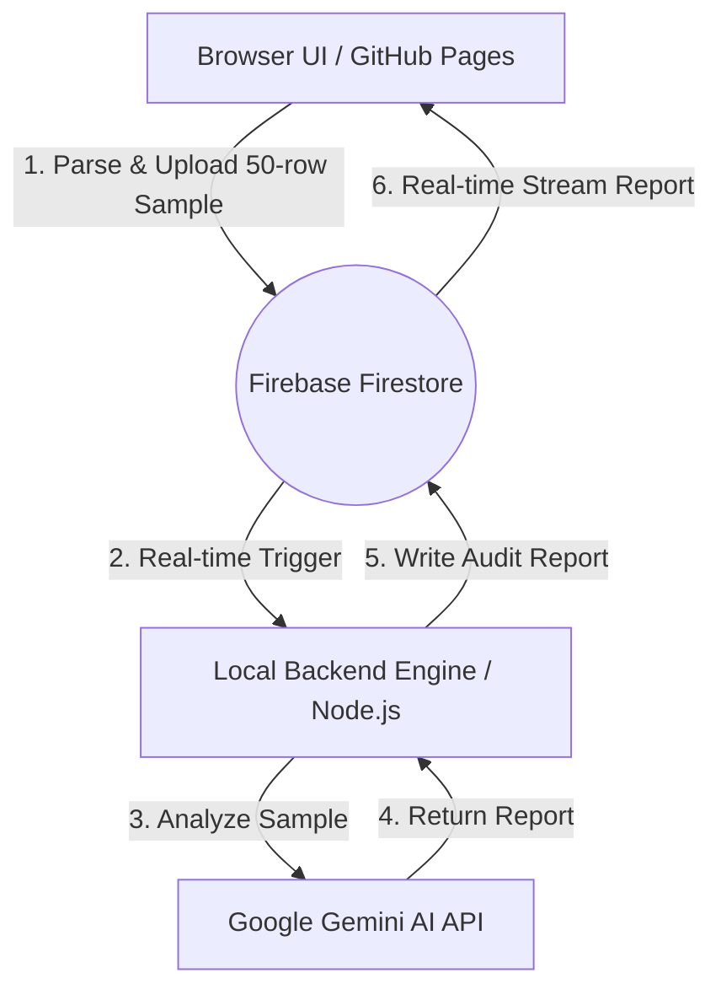

# Global E-commerce Financial Leak Auditor (Hybrid SaaS)

An AI-powered financial leak and operations cost auditor designed for e-commerce sellers (TikTok Shop, Shopify, Shopee). Built on a highly secure, cost-effective **Hybrid SaaS (Serverless / Local Engine)** model.

---

## ✨ Features

- **Zero Server Costs ($0/mo)**: Leverages Firebase Free Tier for coordination and your local machine as the primary processing engine.
- **Privacy First**: Sensitive raw CSV data is processed locally on the client's browser and analyzed by your own secure local engine.
- **AI-Powered Insights**: Detects shipping overcharges, hidden platform fees, and coupon leaks using the Gemini AI API.
- **Real-time Live Updates**: Powered by Firestore Real-time WebSockets to deliver audit reports instantly.

---

## 🏗️ Architecture & How It Works

The project implements a modern **Hybrid SaaS** model to completely eliminate expensive cloud computing bills:



1. **Client Browser**: The user uploads their raw e-commerce CSV. The browser parses it locally, extracts a 50-row preview sample, and uploads the request to Firebase Firestore with a `pending` status.
2. **Local Engine**: A background Node.js engine running on your local computer listens to Firestore. When a `pending` request appears, it triggers the analysis.
3. **AI Audit**: The Local Engine queries the Gemini API to identify financial leaks.
4. **Report Delivery**: The result is written back to Firestore. The client browser, listening in real-time, displays the audit report immediately.

---

## 📂 Project Directory Structure

```text
├── index.html                  # Sleek & modern Dark Mode client UI
├── style.css                   # Premium CSS styles (glassmorphism & animations)
├── app.js                      # Frontend logic utilizing Firebase v10 Modular SDK
├── engine.js                   # Node.js backend engine & local HTTP web server
├── firebase-config.example.js  # Template for Firebase client credentials
├── .env.example                # Template for Local Engine environment variables
└── package.json                # Node.js dependencies configuration
```

---

## 🚀 Client Deployment (GitHub Pages)

Since the frontend is entirely static, it can be deployed for free on GitHub Pages:

1. Push this repository to your GitHub account (make sure `.gitignore` is not modified to protect your secrets).
2. Go to **Settings** -> **Pages** in your repository.
3. Select the branch (e.g., `main`) and folder (e.g., `/root`), then click **Save**.
4. To allow Google Login to work on your deployed site, add your GitHub Pages URL (e.g., `yourusername.github.io`) to **Authorized Domains** in your **Firebase Console -> Authentication -> Settings**.

---

## 📄 License

This project is open-sourced under the MIT License.
